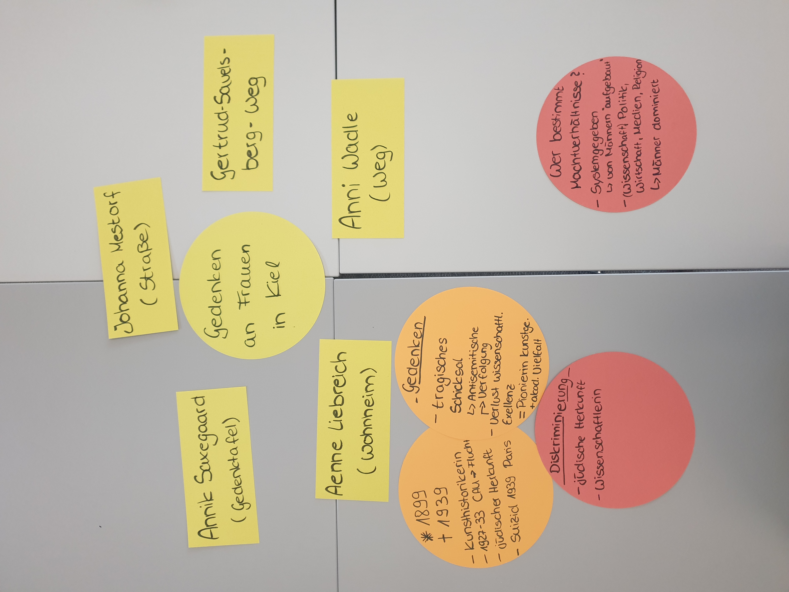

<!--

author: Swantje Piotrowski, Gregor Große-Bölting
email:  ggb@informatik.uni-kiel.de
version: 0.1
language: en
narrator: UK English Female

-->

# Digital Humanities und Prosopographie: Wissenschaftlerinnen im Exil

Ein/e Aufbauseminar/Übung zur Geschichte der Neuzeit

**Dozierende:**

* Dr. Swantje Piotrowski, M.A.
* Dr. Gregor Große-Bölting, M.A., M.A.

**Zeit und Raum:** Do 10:15 - 11:45, UB Kiel, DLL

**Inhalt:**

In der forschungsorientierten Lehrveranstaltung setzen sich die Studierenden mit der Prosopographie als Methode zur Erforschung historischer Personenkollektive auseinander. Aufbauend auf den theoretischen Grundlagen der Prosopographie sammeln, strukturieren und analysieren die Studierenden biografische Informationen über Exil-Wissenschaftlerinnen, um diese in einer vergleichenden Analyse auszuwerten. Die Veranstaltung hat das Format einer digitalen Forschungswerkstatt: Der Arbeitsprozess wird schrittweise entwickelt, praktisch erprobt und reflektiert. Für die prosopographische Analyse steht die webbasierte Forschungsumgebung Nodegoat zur Verfügung. Mithilfe von Nodegoat sollen die biografischen Daten erfasst, verknüpft und bspw. durch Netzwerke visualisiert werden. Durch die Forschungspraxis erwerben die Teilnehmenden digitale Grundkenntnisse sowie Kompetenzen im strukturierten Umgang mit historischen Daten. Die Lehrveranstaltung bietet damit eine solide Grundlage für den kritischen Einsatz digitaler Methoden im Studium und in wissensvermittelnden Berufsfeldern. Prüfungsleistung: Erstellung eines Reflexionsberichts über den Arbeits- und Forschungsprozess sowie eine Visualisierung der Rechercheergebnisse mithilfe von Nodegoat. 

**Lernziele:**

* fachwissenschaftliche Einordnung der Quellen
* vertiefte fachwissenschaftliche Kenntnisse (Frauen- und Geschlechtergeschichte, Biographiegeschichte, Public History, Sammlungsgeschichte)
* Methodenkompetenz im Bereich der Digital Humanities
* Visualisierung und Präsentation der Forschungsergebnisse
* Erfahrungen in den Berufs- und Praxisfeldern Wissensvermittlung
* eigenständiges und selbstorganisiertes Arbeiten

**Weiterführende Links und Literatur:**

* Link zum **DDF:** https://www.digitales-deutsches-frauenarchiv.de
* Link zum **Frauen im Exil:** https://www.exilforschung.de/ag-frauen-im-exil/archiv/
* Link zum **Center for the History of Women Philosophers and Scientists**: https://historyofwomenphilosophers.org/

## Allgemeines und erste Sitzung

### Semesterplan

**Termine:**

| Datum  | Thema/Inhalt                                      | 
|--------|---------------------------------------------------|
| 17.04. | Begrüßung, Organisatorisches, Erwartungen, Fragen |           
| 24.04. | Inhaltliche Einführung in den Themenbereich "Frauen- und Geschlechtergeschichte" | 
| 01.05. | **FEIERTAG - KEIN SEMINAR** | 
| 08.05. | Forschung in der Weimarer Republik und während des Nationalsozialismus |
| 15.05. | Wissenschaftlerinnen im Exil |
| 22.05. | Methode: Prosopographie |
| 29.05. | **FEIERTAG - KEIN SEMINAR**  |
| 05.06. | Einführung in Nodegoat |
| 12.06. | Daten und Metadaten |
| 19.06. | Arbeitssitzung: Datenerfassung in und mit Nodegoat |
| 26.06. | Prosopographisches Arbeiten mit Nodegoat |
| 03.07. | Weitere Analysemöglichkeiten u. Arbeitssitzung Analyse |
| 10.07. | Präsentation der (Zwischen-)Ergebnisse, Evaluation |

### Forschungs(daten)zyklus

### Prüfungsleistung

Produkt zur Darstellung der ausgewählten Quellen inkl. Reflexion zur frauengeschichtlichen Bedeutung.

Details folgen im Laufe des Semesters.

### "Regierungserklärung"

1. Diese Veranstaltung ist eine Forschungswerkstatt: Wir setzen neue Methoden und Software ein. Seien Sie also nachsichtig mit uns und mit sich selbst, wenn mal etwas nicht funktioniert wie geplant. Lassen Sie uns zeitnah wissen, wenn Sie Probleme haben, dann findet sich für alles eine Lösung!
2. Weil es sich um eine Forschungswerkstatt handelt, erwarten wir Eigenengagement und Eigeninitiative für das Thema: Sie werden an verschiedenen Stellen selbst recherchieren, arbeiten und experementieren müssen. Im Gegenzug unterstützen wir Sie, wo wir können.
3. Es kann sein, dass Sie in Ihren Quellen wenig oder gar keine biographischen Details finden: Das ist auch ein Ergebnis, dessen Dokumentation einen Wert hat!
4. Der Seminarplan ist "im Fluss".

### Aufgabe zur nächsten Woche

Bitte lesen Sie zur nächsten Woche die folgenden Artikel:

* Leonie Schöler: Beklaute Frauen: Denkerinnen, Forscherinnen, Pionierinnen: Die unsichtbaren Heldinnen der Geschichte. München 2024, Einleitung, S. 11-23 (im Olat-Ordner).
* [Kirsten Heinsohn](https://docupedia.de/zg/Docupedia:Kirsten_Heinsohn "Docupedia:Kirsten Heinsohn"), [Claudia Kemper](https://docupedia.de/zg/Docupedia:Claudia_Kemper "Docupedia:Claudia Kemper"), Geschlechtergeschichte, in: Docupedia-Zeitgeschichte, 04.12.2012, [http://docupedia.de/zg/heinsohn_kemper_geschlechtergeschichte_v1_de_2012](https://docupedia.de/zg/Docupedia:Kirsten_Heinsohn)

## Sitzung am 24.04.

### Aktuelle Debatten um Stereotypen

> Sind  Geschlechterstereotype aktuell überwunden? Was meinen Sie?

{{1}}
Die bereits erwähnten Stereotypen und bestehenden Vorurteile gegenüber Frauen sind weiterhin präsent, wie eine aktuelle Untersuchung zur "Darstellung von Geschlechterrollen in sozialen Medien und deren Einfluss auf die Geschlechtergerechtigkeit" verdeutlicht:

{{2}}

---

{{3}}

### Gruppenarbeit Mind-Map 

1. Bitte recherchieren Sie gemeinsam im Internet, welche öffentlichen historische Stadtmarkierungen es in Kiel gibt, die sich mit dem Gedenken an Frauen beschäftigen (bspw. Straßennamen, Plätze, Denkmäler, Wohn- und Studierendenheime, etc.). Notieren Sie bitte min. 5 *Erinnerungsformen*.
2. Notieren Sie für eine der recherchierten Frauen weitere Informationen zu ihrem Lebenslauf und mögliche Gründe, warum ihr im öffentlichen Raum gedacht wird.
3. Finden Sie in den Biographien der Frauen weitere Diskriminierungskategorien außer dem Geschlecht? (bspw. Religion, soziale / ethnische Herkunft, Alter, Bildungsgrad etc.)
4. Wer bestimmte und bestimmt in unserer Gesellschaft über bestehende Machtverhältnisse?  Was zeichnet diese Personen aus?
  
Fassen Sie bitte Ihre Ergebnisse in Form einer Mind-Map zusammen und erläutern kurz die Ergebnisse.

(ca. 30 Min. Gruppenarbeit + 30 Min. Präsentation)

#### Gruppe 1

#### Gruppe 2

#### Gruppe 3

### Definition Frauengeschichte

> "Ordnungsideen beeinflussen die gesellschaftlichen Vorstellungen von den Aufgaben und Handlungsräumen von Männern und Frauen und prägen deren Lebenswirklichkeit. Frauengeschichte untersucht hierbei vor allem, unter welchen Bedingungen sich Handlungsmöglichkeiten, Normen und soziale Praxen für Frauen änderten." (nach Kirsten Heinsohn)

### Definition Geschlechtergeschichte

> "Umfassender als die Frauengeschichte will die Geschlechtergeschichte die vielfältigen Beziehungsgeflechte und sozialen Konstruktionen von Gesellschaften erforschen, die im Zeichen geschlechtsspezifischer Zuordnungen ihre Gültigkeit erlangen." (nach Kirsten Heinsohn)

### Konzept der Intersektionalität

> "Den Begriff Intersectionality prägte die Professorin Kimberlé W. Crenshaw 1989 in den USA. Sie erforschte, wie mehrfach marginalisierte Frauen diskriminiert werden. Dabei bediente sie sich der Metapher der Straßenkreuzung (englisch: „intersection“). Wenn sich verschiedene Merkmale bzw. Marginalisierungen in einer Person kreuzen, kann diese von einer spezifischen Form der Diskriminierung betroffen sein, die jemand mit einer anderen Kombination von Merkmalen nicht erlebt."

### Aufgabe zur nächsten Woche

Bitte lesen Sie zur nächsten Woche die folgenden Artikel:

* Moritz Florin, Victoria Gutsche, Natalie Krentz (Hg.): Diversität historisch - Repräsentationen und Praktiken gesellschaftlicher Differenzierung im Wandel, 2018. (Olat-Ordner)
* Annette Vogt: Wissenschaftlerinnen im Exil - Abbruch, Neubeginn oder Erfolg der Karriere, S. 19-46, in: Inge Hansen-Schaberg / Hiltrud Häntzschel (Hg.): Alma Maters Töchter im Exil - Zur Vertreibung von Wissenschaftlerinnen und Akademikerinnen in der NS-Zeit. München 2011.
* Grüttner, M. (2021). The Expulsion of Academic Teaching Staff from German Universities, 1933–45. Journal of Contemporary History, 57(3), 513–533. https://doi.org/10.1177/00220094211063074 (frei verfügbar, hier: https://api-depositonce.tu-berlin.de/server/api/core/bitstreams/8d843318-c8d0-4f11-9b01-0c1b06689006/content)

## Sitzung am 08.05. 

