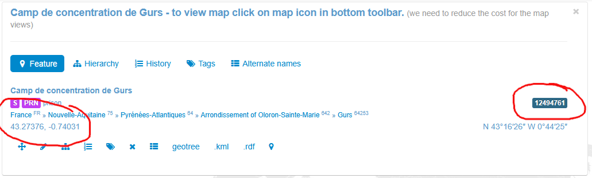

<!--

author: Swantje Piotrowski, Gregor Große-Bölting
email:  ggb@informatik.uni-kiel.de
version: 0.1
language: en
narrator: UK English Female

-->

# Digital Humanities und Prosopographie: Wissenschaftlerinnen im Exil

Ein/e Aufbauseminar/Übung zur Geschichte der Neuzeit

**Dozierende:**

* Dr. Swantje Piotrowski, M.A.
* Dr. Gregor Große-Bölting, M.A., M.A.

**Zeit und Raum:** Do 10:15 - 11:45, UB Kiel, DLL

**Inhalt:**

In der forschungsorientierten Lehrveranstaltung setzen sich die Studierenden mit der Prosopographie als Methode zur Erforschung historischer Personenkollektive auseinander. Aufbauend auf den theoretischen Grundlagen der Prosopographie sammeln, strukturieren und analysieren die Studierenden biografische Informationen über Exil-Wissenschaftlerinnen, um diese in einer vergleichenden Analyse auszuwerten. Die Veranstaltung hat das Format einer digitalen Forschungswerkstatt: Der Arbeitsprozess wird schrittweise entwickelt, praktisch erprobt und reflektiert. Für die prosopographische Analyse steht die webbasierte Forschungsumgebung Nodegoat zur Verfügung. Mithilfe von Nodegoat sollen die biografischen Daten erfasst, verknüpft und bspw. durch Netzwerke visualisiert werden. Durch die Forschungspraxis erwerben die Teilnehmenden digitale Grundkenntnisse sowie Kompetenzen im strukturierten Umgang mit historischen Daten. Die Lehrveranstaltung bietet damit eine solide Grundlage für den kritischen Einsatz digitaler Methoden im Studium und in wissensvermittelnden Berufsfeldern. Prüfungsleistung: Erstellung eines Reflexionsberichts über den Arbeits- und Forschungsprozess sowie eine Visualisierung der Rechercheergebnisse mithilfe von Nodegoat. 

**Lernziele:**

* fachwissenschaftliche Einordnung der Quellen
* vertiefte fachwissenschaftliche Kenntnisse (Frauen- und Geschlechtergeschichte, Biographiegeschichte, Public History, Sammlungsgeschichte)
* Methodenkompetenz im Bereich der Digital Humanities
* Visualisierung und Präsentation der Forschungsergebnisse
* Erfahrungen in den Berufs- und Praxisfeldern Wissensvermittlung
* eigenständiges und selbstorganisiertes Arbeiten

**Weiterführende Links und Literatur:**

* Link zum **DDF:** https://www.digitales-deutsches-frauenarchiv.de
* Link zum **Frauen im Exil:** https://www.exilforschung.de/ag-frauen-im-exil/archiv/
* Link zum **Center for the History of Women Philosophers and Scientists**: https://historyofwomenphilosophers.org/

## Allgemeines und erste Sitzung

### Semesterplan

**Termine:**

| Datum  | Thema/Inhalt                                      | 
|--------|---------------------------------------------------|
| 17.04. | Begrüßung, Organisatorisches, Erwartungen, Fragen |           
| 24.04. | Inhaltliche Einführung in den Themenbereich "Frauen- und Geschlechtergeschichte" | 
| 01.05. | **FEIERTAG - KEIN SEMINAR** | 
| 08.05. | Wissenschaftlerinnen im Exil, Forschung in der Weimarer Republik und während des Nationalsozialismus |
| 15.05. | Methode: Prosopographie |
| 22.05. | Philosophinnen im Exil, mögliche Forschungsfragen |
| 29.05. | **FEIERTAG - KEIN SEMINAR**  |
| 05.06. | Daten und Metadaten |
| 12.06. | Einführung in Nodegoat |
| 19.06. | Arbeitssitzung: Datenerfassung in und mit Nodegoat |
| 26.06. | Prosopographisches Arbeiten mit Nodegoat |
| 03.07. | Weitere Analysemöglichkeiten u. Arbeitssitzung Analyse |
| 10.07. | Präsentation der (Zwischen-)Ergebnisse, Evaluation |

### Forschungs(daten)zyklus

### Prüfungsleistung

Produkt zur Darstellung der ausgewählten Quellen inkl. Reflexion zur frauengeschichtlichen Bedeutung.

Details folgen im Laufe des Semesters.

### "Regierungserklärung"

1. Diese Veranstaltung ist eine Forschungswerkstatt: Wir setzen neue Methoden und Software ein. Seien Sie also nachsichtig mit uns und mit sich selbst, wenn mal etwas nicht funktioniert wie geplant. Lassen Sie uns zeitnah wissen, wenn Sie Probleme haben, dann findet sich für alles eine Lösung!
2. Weil es sich um eine Forschungswerkstatt handelt, erwarten wir Eigenengagement und Eigeninitiative für das Thema: Sie werden an verschiedenen Stellen selbst recherchieren, arbeiten und experementieren müssen. Im Gegenzug unterstützen wir Sie, wo wir können.
3. Es kann sein, dass Sie in Ihren Quellen wenig oder gar keine biographischen Details finden: Das ist auch ein Ergebnis, dessen Dokumentation einen Wert hat!
4. Der Seminarplan ist "im Fluss".

### Aufgabe zur nächsten Woche

Bitte lesen Sie zur nächsten Woche die folgenden Artikel:

* Leonie Schöler: Beklaute Frauen: Denkerinnen, Forscherinnen, Pionierinnen: Die unsichtbaren Heldinnen der Geschichte. München 2024, Einleitung, S. 11-23 (im Olat-Ordner).
* [Kirsten Heinsohn](https://docupedia.de/zg/Docupedia:Kirsten_Heinsohn "Docupedia:Kirsten Heinsohn"), [Claudia Kemper](https://docupedia.de/zg/Docupedia:Claudia_Kemper "Docupedia:Claudia Kemper"), Geschlechtergeschichte, in: Docupedia-Zeitgeschichte, 04.12.2012, [http://docupedia.de/zg/heinsohn_kemper_geschlechtergeschichte_v1_de_2012](https://docupedia.de/zg/Docupedia:Kirsten_Heinsohn)

## Sitzung am 24.04.

### Aktuelle Debatten um Stereotypen

> Sind  Geschlechterstereotype aktuell überwunden? Was meinen Sie?

{{1}}
Die bereits erwähnten Stereotypen und bestehenden Vorurteile gegenüber Frauen sind weiterhin präsent, wie eine aktuelle Untersuchung zur "Darstellung von Geschlechterrollen in sozialen Medien und deren Einfluss auf die Geschlechtergerechtigkeit" verdeutlicht:

{{2}}

---

{{3}}

### Gruppenarbeit Mind-Map 

1. Bitte recherchieren Sie gemeinsam im Internet, welche öffentlichen historische Stadtmarkierungen es in Kiel gibt, die sich mit dem Gedenken an Frauen beschäftigen (bspw. Straßennamen, Plätze, Denkmäler, Wohn- und Studierendenheime, etc.). Notieren Sie bitte min. 5 *Erinnerungsformen*.
2. Notieren Sie für eine der recherchierten Frauen weitere Informationen zu ihrem Lebenslauf und mögliche Gründe, warum ihr im öffentlichen Raum gedacht wird.
3. Finden Sie in den Biographien der Frauen weitere Diskriminierungskategorien außer dem Geschlecht? (bspw. Religion, soziale / ethnische Herkunft, Alter, Bildungsgrad etc.)
4. Wer bestimmte und bestimmt in unserer Gesellschaft über bestehende Machtverhältnisse?  Was zeichnet diese Personen aus?
  
Fassen Sie bitte Ihre Ergebnisse in Form einer Mind-Map zusammen und erläutern kurz die Ergebnisse.

(ca. 30 Min. Gruppenarbeit + 30 Min. Präsentation)

#### Gruppe 1

#### Gruppe 2

#### Gruppe 3

### Definition Frauengeschichte

> "Ordnungsideen beeinflussen die gesellschaftlichen Vorstellungen von den Aufgaben und Handlungsräumen von Männern und Frauen und prägen deren Lebenswirklichkeit. Frauengeschichte untersucht hierbei vor allem, unter welchen Bedingungen sich Handlungsmöglichkeiten, Normen und soziale Praxen für Frauen änderten." (nach Kirsten Heinsohn)

### Definition Geschlechtergeschichte

> "Umfassender als die Frauengeschichte will die Geschlechtergeschichte die vielfältigen Beziehungsgeflechte und sozialen Konstruktionen von Gesellschaften erforschen, die im Zeichen geschlechtsspezifischer Zuordnungen ihre Gültigkeit erlangen." (nach Kirsten Heinsohn)

### Aufgabe zur nächsten Woche

Bitte lesen Sie zur nächsten Woche die folgenden Artikel:

* Moritz Florin, Victoria Gutsche, Natalie Krentz (Hg.): Diversität historisch - Repräsentationen und Praktiken gesellschaftlicher Differenzierung im Wandel, 2018. (Olat-Ordner)
* Annette Vogt: Wissenschaftlerinnen im Exil - Abbruch, Neubeginn oder Erfolg der Karriere, S. 19-46, in: Inge Hansen-Schaberg / Hiltrud Häntzschel (Hg.): Alma Maters Töchter im Exil - Zur Vertreibung von Wissenschaftlerinnen und Akademikerinnen in der NS-Zeit. München 2011.
* Grüttner, M. (2021). The Expulsion of Academic Teaching Staff from German Universities, 1933–45. Journal of Contemporary History, 57(3), 513–533. https://doi.org/10.1177/00220094211063074 (frei verfügbar, hier: https://api-depositonce.tu-berlin.de/server/api/core/bitstreams/8d843318-c8d0-4f11-9b01-0c1b06689006/content)

## Sitzung am 08.05. 

### Aufgabe

Denken Sie in Kleingruppen von 3 bis 4 Personen über die Texte nach, jede Gruppe beschäftigt sich mit einem Text. Reflektieren Sie die wichtigsten Aussagen der Texte anhand der Exilierungsgeschichte von Aenne Liebreich ([Biographie bei der CAU](https://www.uni-kiel.de/de/universitaet/profil/geschichte-der-universitaet/ns-aufarbeitung/vertriebene-gelehrte), [Biographie des Studentenwerks](https://studentenwerk.sh/de/geschichte-eines-namenswechsels), [Dictionary of Art Historians](https://arthistorians.info/liebreicha)): 

1. Welche Intersektionalitätsdimensionen lassen sich anhand der Person von Aenne Liebreich identifizieren? Was ist der Mehrwert einer solchen Betrachtung für die Geschichtswissenschaften?
2. Wie lassen sich die "Fünf Voraussetzungen für Wissenschaftlerinnen und ihren Erfolg im Exil" von Annette Vogt auf Liebreich anwenden?
3. Wie lässt sich Liebreich in den Exilierungsphasen von Grüttner verorten? Wie ordnet Grüttner allgemein das Schicksal von Wissenschaftlerinnen ein? 

Gehen Sie von den Fragen aus und versuchen Sie - sofern die Zeit reicht - sich Gedanken über den weiteren Kontext (allgemein Wissenschafterlerinnen im Exil) zu machen. 

Notieren Sie gerne Fragen für die Diskussion im Plenum. 

### Konzept der Intersektionalität

* "Intersektionalität“ (von englisch Intersection = Straßenkreuzung) ist ein Konzept, das maßgeblich von Kimberlé Crenshaw (Race/Class/Gender) entwickelt wurde.
* Es beschreibt, wie verschiedene soziale Kategorien wie z.B. Geschlecht, Ethnizität, soziale Herkunft oder sexuelle Orientierung nicht nur additiv wirken, sondern in ihrem Zusammenspiel neue, spezifische Formen von Diskriminierung und Privilegien erzeugen.
* Das Konzept hilft, die komplexen Wechselwirkungen historischer und gesellschaftlicher Machtstrukturen zu verstehen.

### Aufgabe zur nächsten Woche

Bitte lesen Sie zur nächsten Woche die folgenden Artikel:

* Baille, J. (2024). An Introduction to Prosopography. https://campus.dariah.eu/id/zGC8YxQVWeqKN51aGjkYq
* Lemercier, C. (2019). Quantitative methods in the humanities (C. Zalc & A. Goldhammer, Eds.). University of Virginia Press, Kapitel 2 (im OLAT)

Und optional: 

* Verboven, K., Carlier, M., & Dumolyn, J. (2007). A short manual to the art of prosopography. In Prosopography Approaches and Applications. A Handbook (pp. 35–70). Unit for Prosopographical Research (Linacre College). http://doi.org/1854/8212 (im OLAT)

## Sitzung am 15.05.

### Forschungsprojekte im Bereich der Personenforschung 

Identifizieren Sie in Kleingruppen für jede der folgenden Personendatenbanken die zuvor in der Plenumsdiskussion genannten Merkmale, die für prosopographisches Arbeiten wichtig sind (Prosopon, Scope, Forschungsanliegen). 

Formulieren Sie eine konkrete Forschungsfrage, die sich durch die jeweilige Datenbank beantworten ließe.

* Kieler Gelehrtenverzeichnis: https://cau.gelehrtenverzeichnis.de/?lang=de
* Repertorium Academicum Germanicum (RAG): https://rag-online.org/
* Schleswig-Holsteinische Pastoren der NS-Zeit: https://pastorenverzeichnis.de/ 

### Aufgabe zur nächsten Woche

Schauen Sie sich die [Sammlung der Philosophinnen](https://liascript.github.io/course/?https://raw.githubusercontent.com/DH-Lehre/Sammlung-Philosophinnen-im-Exil/refs/heads/main/Sammlung_Philosophinnen_im_Exil.md#1) im Exil an. Identifizieren Sie das Prosopon (und dessen Ausgestaltung), den Scope und machen Sie sich Gedanken über ein mögliches Forschungsanliegen/Forschungsfragen, die mit dem Material beantwortet werden können. 

Lesen Sie zur folgenden Sitzung bitte außerdem (im OLAT Materialverzeichnis zu finden):

* Drucker, J. (2021). Data modeling and use. In The Digital Humanities Coursebook. An Introduction to Digital Methods for Research and Scholarship. Routledge.

## Sitzung am 22.05.

### Datenmodell, Entwurf

| Kategorien   | Datentyp(en)   | Beispiel   |
| :--------- | :--------- | :--------- |
| Geburtsort    |      |      |
| Geburtsdatum    | YYYY-MM-DD     | 1899-04-05 |
| Studienort    |      |      |
| Wirkungsort    |      |      |
| Diskriminierungskategorien    |      |     |
| Gründe für das Exil    |      |      |
| Religion   |      |     |
|     |      |      |

### Aufgabe zur nächsten Woche 

Erstellen Sie anhand des Fragenkatalogs im Text von Johanna Drucker (S. 23f.) ein Datenmodell zur Erfassung der Philosophinnen im Exil. Schicken Sie Ihre Ergebnisse bis zum (einschließlich) 02.06. an s.piotrowski@email.uni-kiel.de und ggb@informatik.uni-kiel.de.  

## Sitzung am 29.05.

Entfällt, weil Feiertag. 

## Sitzung am 05.06.

### Datenmodell: Alle Vorschläge vereinigt

**Daten zur Person:**

| Kategorien   | Datentyp(en)   | Beispiel   | Nennungen |
| :--------- | :--------- | :--------- | :--------- |
| Name    |      |      | 5 |
| Bild / Photo | Bilddatei (jpeg, png) |   |  1 |
| Bildquelle, -lizenz |   |    | 1 |
| Herkunftsland |   |   | 3 |
| Geburtsort    |      |      | 2 |
| Geburtsdatum    | YYYY-MM-DD     | 1899-04-05 | 7 |
| Sterbeort    |     |  | 3 |
| Sterbedatum    |  YYYY-MM-DD | 1899-04-05 | 8 |
| Religion   |      |     | 5 |
| Familienstand |   |   | 2 | 
| Studienort    |      |      | 6 |
| akademischer Grad / Karriere    |      |      | 3 |
| Schule |   |   | 1 |
| Studium |   |   | 1 |
| Promotion | string, Titel der Thesis  |   | 1 |
| Arbeitsort(e)    |      |      | 3 |
| Institutionen/Tätigkeiten vor dem Exil |   |   | 2 |
| Forschungsbereiche, Forschungsthemen(, Beruf?)    |      |      | 4 |
| Fachrichtung(en)    |      |      | 1 |
| Sprache(n) |   |   | 2 |
| Preise / Ehrungen    |      |      | 1 |
| Beziehungen / Netzwerke / Kontakte / Organisationen |   |   | 3 |

**Daten zum Exil:**

| Kategorien   | Datentyp(en)   | Beispiel   | Nennungen |
| :--------- | :--------- | :--------- | :--------- |
| Diskriminierungskategorien  | Kategorien |     | 6 |
| Gründe für das Exil    |      |      | 6 |
| Art des Exils |   | Flucht, inneres Exil, etc. | 2 |
| Exilorte/-länder    | Liste von Orten mit Datumsangaben |      | 7 |
| Exilzeitraum | Datumsbereich |   | 6 |
| Institutionen/Tätigkeiten im Exil (m. Qualifizierung bspw. von Brüchen in der Karriere) |   |   | 3 |
| Rückkehr nach Deutschland? |   |   | 3 |
| Im Exil verstorben? |   |   | 1 |
| Hat im Exil weiterarbeiten können? |   |   | 1 |

**Literatur/Quellen von/über die Person:**

| Kategorien   | Datentyp(en)   | Beispiel   | Nennungen |
| :--------- | :--------- | :--------- | :--------- |
| Publikationen (im Exil) |   |   | 5 |
| Biografische Quellen |   |   | 3 |
| Literatur zur Person |   |   | 3 |
| Selbstzeugnisse |  |  |  |
| Bewertung des Exils | |  |  |
| Siehe auch... |   |   | 1 |
| Kommentar | Freitext |   | 1 |

### Wiederholung

Was bisher geschah... 

### Forschungsfragen 

Wie formuliert man eine Forschungsfrage? Was ist zu beachten und was macht eine *gute* Forschungsfrage aus?

### Ink Shedding

1. Falten Sie ein DIN A4-Blatt vertikal in der Mitte. Vervollständigen Sie auf der linken Seite des Knicks den nachfolgenden Satz. Nutzen Sie die komplette linke Seite und schreiben Sie möglichst (in Deutsch oder Englisch) leserlich! Sie haben 10 Minuten Zeit.

> Das/die Thema/Schicksal/Biographie(n) ... in Bezug auf die Exilwissenschaftlerinnnen interessiert/en mich, weil ... 

2. Anschließend werden alle Zettel eingesammelt, gemischt und erneut ausgeteilt. Lesen Sie den (hoffentlich fremden) Text, markieren und kommentieren Sie die Punkte, die Ihnen besonders gut gefallen und spannend sind. Achten Sie auf interessante Inhalte und kommentieren Sie bitte immer positiv, etwa so: „Großartige Idee! Dazu fällt mir auch ein, dass …“. Dazu stehen 5 bis 10 Minuten zur Verfügung.
3. Wir wiederholen 2. ein zweites Mal.

## Sitzung am 12.06.

In dieser Sitzung haben wir das Datenmodell weiter diskutiert und für Nodegoat umgesetzt. 

## Sitzung am 19.06.

### Erfassung von Geodaten (Ortschaften)

Um ein Ereignis (oder Geburt/Tod) mit einer Ortschaft zu verbinden, können Sie wie folgt vorgehen: 

**1. Öffnen Sie das entsprechende Ereignis** und ändern Sie unter *Location* die *Reference* zu *Ortschaft* und *Location*, wie im Screenshot zu sehen ist:

**2. Wählen Sie einen Ort aus oder erstellen Sie einen neuen Ort** in dem Sie auf die Suche (Feld mit Lupe) klicken. Um einen neuen Ort zu erstellen, wählen Sie *new* (am Ende der Liste) aus. Ist der Ort bereits vorhanden und auswählbar, sind sie schon fertig. Andernfalls geht es mit Schritt 3 weiter. 

**3. Wenn Sie *new* angeklickt haben, öffnet sich der Dialog zum Anlegen einer Ortschaft.** In diesem Fall müssen Sie einen Namen für die neu anzulegende Ortschaft angeben und die übrigen Informationen bei [geonames.org](https://www.geonames.org/) recherchieren (nächster Schritt).

**4. Suchen Sie den Ort bei [geonames.org](https://www.geonames.org/).** Stellen Sie sicher, dass Sie die korrekte Verwaltungseinheit ausgewählt haben, das heißt, dass es sich bspw. bei dem Ort Berlin um die Stadt und nicht das Bundesland handelt. Klicken Sie auf den entsprechenden Eintrag. Sie erhalten eine Übersicht, wie im Screenshot. Kopieren Sie die Einträge für *langitude*, *latitude*, sowie die *Geonames-ID* (im Screenshot hervorgehoben).

**5. Fügen Sie die kopierten Informationen in Nodegoat in Ihren Eintrag für die Ortschaft ein.** Alle Informationen müssen vorhanden sein. Wenn Sie das Fenster schließen. Ist die neu angelegte Ortschaft automatisch für das Ereignis ausgewählt. 

**Fertig!**

### Aufgabe zur nächsten Woche 

Bitte vervollständigen Sie die Informationen zu Ihren drei Philosophinnen in Nodegoat so weit, wie möglich. 

Melden Sie sich bei uns, falls Sie auf Probleme stoßen oder Fragen haben!
